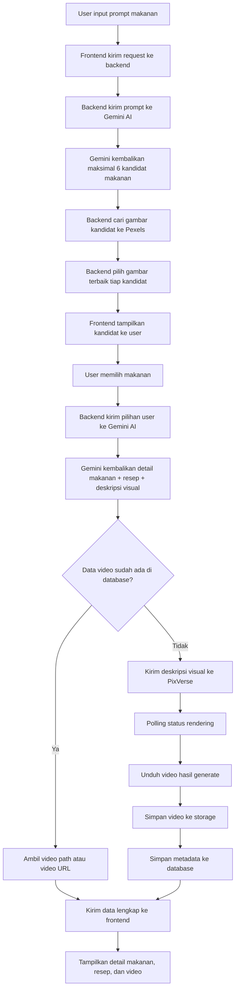
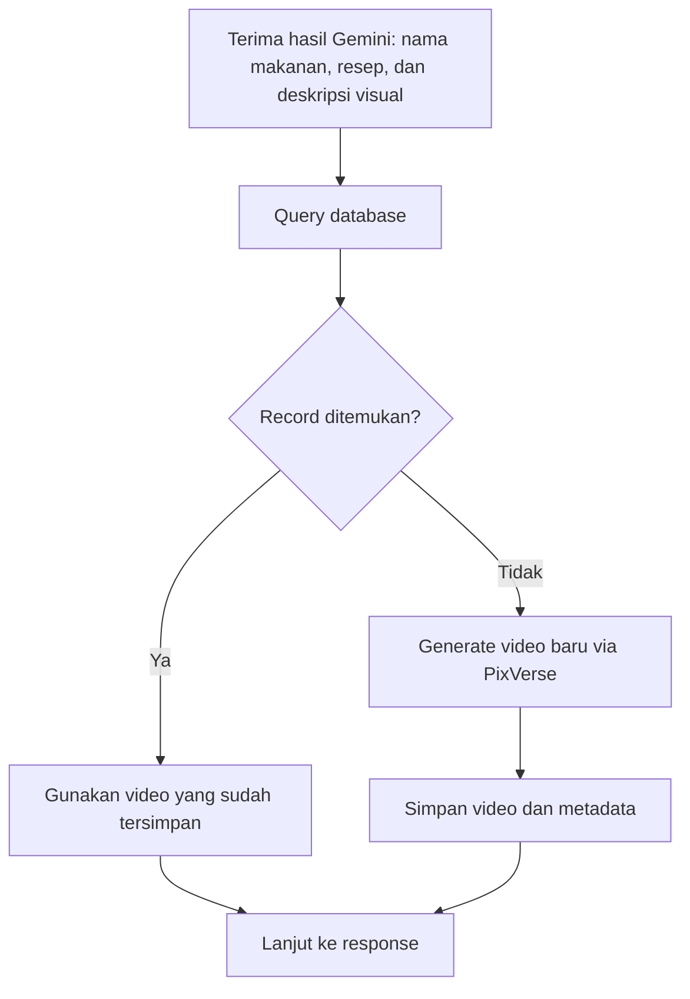
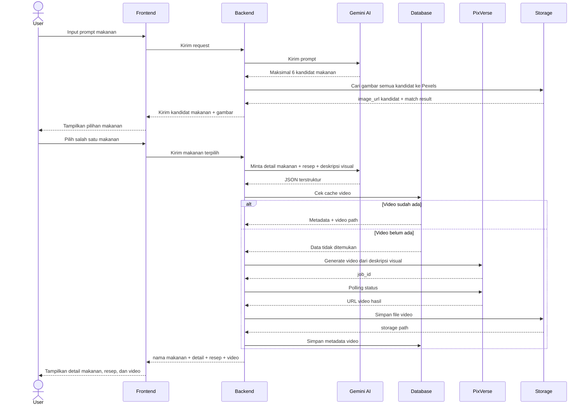

# System Workflow

Dokumen ini menjelaskan alur kerja sistem untuk fitur `AI Food Inspiration`, yaitu pencarian ide makanan berbasis prompt, pemilihan kandidat makanan, pendalaman detail makanan, resep cara membuat, dan pembuatan video untuk kebutuhan testing/MVP.

## Tujuan

Sistem menerima prompt makanan dari user, menampilkan daftar kandidat makanan beserta gambar, meminta user memilih salah satu kandidat, lalu melanjutkan ke detail makanan, resep cara membuat, pengecekan cache video, dan menampilkan hasil akhir berupa informasi makanan dan video.

## Workflow Utama

### 1. User Input Prompt

User mengisi prompt makanan, misalnya:

`"makanan gurih pedas yang cocok dimakan malam hari"`

Data yang dikirim dari frontend:

```json
{
  "prompt": "makanan gurih pedas yang cocok dimakan malam hari"
}
```

### 2. Pemrosesan Prompt Awal oleh Gemini AI

Backend mengirim `prompt` ke Gemini AI untuk menghasilkan daftar kandidat makanan yang paling relevan.

Gemini dapat mengembalikan maksimal `6 kandidat makanan` untuk satu prompt.

Setiap kandidat makanan perlu memiliki gambar agar mudah dipilih user. Untuk MVP, backend menggunakan `Pexels API` untuk mencari gambar kandidat berdasarkan `nama_makanan` dan kata kunci visual singkat.

Urutan pencarian gambar kandidat:

- backend membentuk query pencarian gambar dari `nama_makanan`
- backend mencari gambar ke `Pexels` untuk semua kandidat
- backend memilih satu gambar terbaik untuk tiap kandidat
- jika hasil tidak cocok, gunakan placeholder image

Output tahap awal yang diharapkan dari Gemini:

```json
{
  "candidates": [
    {
      "id": "food-1",
      "nama_makanan": "Seblak",
      "deskripsi_singkat": "Makanan pedas gurih berkuah dengan topping beragam",
      "image_url": "https://example.com/images/seblak.jpg"
    },
    {
      "id": "food-2",
      "nama_makanan": "Mie Gacoan",
      "deskripsi_singkat": "Mie pedas dengan rasa gurih dan cocok untuk makan malam",
      "image_url": "https://example.com/images/mie-pedas.jpg"
    }
  ]
}
```

### 3. User Memilih Kandidat Makanan

Frontend menampilkan daftar kandidat makanan dalam bentuk card berisi:

- nama makanan
- deskripsi singkat
- gambar makanan

Jika gambar kandidat tersedia, frontend menampilkan thumbnail atau hero image pada setiap card agar user lebih mudah membedakan pilihan makanan.

Jumlah kandidat yang ditampilkan pada tahap ini maksimal `6 card`.

Setelah itu user memilih salah satu kandidat makanan yang paling sesuai.

Data yang dikirim ke backend setelah user memilih kandidat:

```json
{
  "prompt": "makanan gurih pedas yang cocok dimakan malam hari",
  "selected_food_id": "food-1",
  "selected_food_name": "Seblak"
}
```

### 4. Pemrosesan Detail oleh Gemini AI

Backend mengirim `prompt` dan makanan yang dipilih user ke Gemini AI untuk diolah menjadi data terstruktur yang lebih detail.

Hanya kandidat yang dipilih user yang diproses ke tahap ini. Kandidat lain tidak diproses lebih lanjut untuk resep detail atau video agar lebih hemat biaya dan lebih cepat.

Output detail yang diharapkan dari Gemini:

```json
{
  "nama_makanan": "Seblak",
  "deskripsi_detail": "Seblak adalah makanan khas dengan cita rasa gurih pedas, tekstur kenyal, dan aroma kencur yang kuat.",
  "karakter_rasa": ["gurih", "pedas", "sedikit smoky"],
  "tekstur": "kenyal dan berkuah",
  "bahan_utama": ["kerupuk", "cabai", "kencur", "telur"],
  "resep_bahan": [
    "100 gram kerupuk bawang",
    "2 butir telur",
    "5 cabai rawit",
    "2 siung bawang putih",
    "1 ruas kencur"
  ],
  "langkah_memasak": [
    "Rendam kerupuk hingga sedikit lunak.",
    "Haluskan cabai, bawang putih, dan kencur.",
    "Tumis bumbu halus hingga harum.",
    "Masukkan telur lalu orak-arik.",
    "Tambahkan air dan kerupuk, lalu masak hingga kuah meresap."
  ],
  "cocok_untuk": "makan malam atau saat cuaca dingin",
  "deskripsi_visual": "Close-up semangkuk seblak merah pedas dengan topping melimpah, uap hangat, pencahayaan sinematik, tampilan menggugah selera"
}
```

### 5. Pengecekan Database atau Cache

Backend mengecek database berdasarkan kombinasi berikut:

- `nama_makanan`
- `prompt_hash` atau versi prompt

Kondisi:

- Jika data ditemukan, backend mengambil `video_path` atau `video_url` dari storage/database.
- Jika data tidak ditemukan, backend melanjutkan ke proses generasi video.

### 6. Generasi Video via PixVerse API

Jika cache tidak tersedia, backend mengirim `deskripsi_visual` ke PixVerse API untuk membuat video.

Alur proses:

- kirim prompt video ke PixVerse
- terima `job_id`
- polling status rendering sampai selesai
- ambil URL hasil video setelah status `completed`

### 7. Penyimpanan Video dan Metadata

Setelah video selesai dibuat:

- unduh video dari PixVerse
- simpan ke local storage atau cloud storage
- simpan metadata ke database

Contoh data yang disimpan:

```json
{
  "nama_makanan": "Seblak",
  "prompt_hash": "abc123xyz",
  "deskripsi_visual": "Close-up semangkuk seblak merah pedas dengan topping melimpah, uap hangat, pencahayaan sinematik, tampilan menggugah selera",
  "video_path": "/videos/seblak-abc123xyz.mp4"
}
```

### 8. Tampilkan Hasil ke User

Frontend menampilkan:

- nama makanan
- deskripsi detail
- karakter rasa
- tekstur
- bahan utama
- resep bahan
- langkah memasak
- momen yang cocok
- video hasil generate

## Workflow Gabungan End-to-End

1. User mengirim prompt makanan
2. Backend meneruskan prompt ke Gemini AI untuk mengambil kandidat makanan
3. Gemini mengembalikan maksimal 6 kandidat makanan
4. Backend mencari gambar untuk semua kandidat ke Pexels
5. Backend memilih satu gambar terbaik untuk tiap kandidat
6. Frontend menampilkan daftar kandidat ke user
7. User memilih salah satu kandidat makanan
8. Backend meminta detail makanan, resep, dan deskripsi visual berdasarkan pilihan user
9. Backend cek database/cache
10. Jika video sudah ada, backend ambil video dari storage
11. Jika video belum ada, backend generate video via PixVerse
12. Backend simpan video dan metadata ke database
13. Backend kirim hasil lengkap ke frontend
14. Frontend menampilkan detail makanan, resep, dan video

## Diagram Workflow

### 1. Diagram Alur Utama



### 2. Diagram Keputusan Cache



### 3. Diagram Sequence End-to-End



## Komponen Sistem

### Frontend

- form input prompt makanan
- daftar kandidat makanan bergambar
- halaman pemilihan makanan
- halaman hasil
- player video
- section resep

### Backend

- endpoint menerima request user
- integrasi Gemini AI untuk kandidat makanan
- service pencarian gambar kandidat via `Pexels`
- integrasi Gemini AI untuk detail makanan
- cache/database checker
- integrasi PixVerse API
- penyimpanan ke database dan storage

### Database

Database utama yang digunakan adalah `PostgreSQL`.

Data minimal yang disimpan:

- `nama_makanan`
- `food_image_url`
- `food_image_source`
- `food_image_match_score`
- `deskripsi_detail`
- `karakter_rasa`
- `tekstur`
- `bahan_utama`
- `resep_bahan`
- `langkah_memasak`
- `cocok_untuk`
- `deskripsi_visual`
- `prompt_hash`
- `video_path`
- `created_at`

Untuk tahap MVP, field seperti `karakter_rasa`, `bahan_utama`, `resep_bahan`, dan `langkah_memasak` dapat disimpan dalam format `JSONB` agar implementasi lebih cepat dan fleksibel.

## Rekomendasi untuk MVP

- tampilkan kandidat makanan bergambar sebelum masuk ke detail
- gunakan `Pexels` untuk gambar kandidat makanan
- batasi jumlah kandidat makanan menjadi maksimal 6 item
- proses detail, resep, dan video hanya untuk kandidat yang dipilih user
- gunakan `PostgreSQL` sebagai database utama
- tampilkan resep sederhana yang mudah diikuti user
- simpan hasil video agar tidak generate ulang untuk request yang sama
- tambahkan validasi response JSON dari Gemini
- gunakan polling sederhana untuk status video dari PixVerse
- gunakan placeholder image jika hasil gambar kandidat tidak relevan

## Catatan Risiko

- output Gemini bisa tidak konsisten jika prompt terlalu ambigu
- hasil pencarian gambar di Pexels bisa tidak selalu cocok untuk makanan lokal tertentu
- proses render video bisa lama, sehingga frontend sebaiknya menampilkan status loading atau processing
- cache key perlu dirancang rapi agar video tidak tertukar antar prompt yang mirip

## Saran Pengembangan Berikutnya

- tambahkan tingkat kepedasan, kategori makanan, atau mood makanan
- tambahkan fitur simpan favorit atau riwayat pencarian
- tambahkan job queue untuk proses video agar tidak blocking
- simpan cache key yang lebih konsisten, misalnya berbasis slug atau hash
